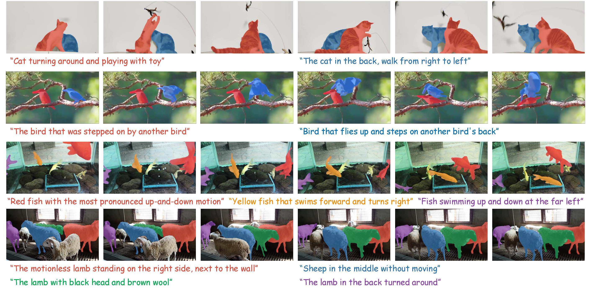
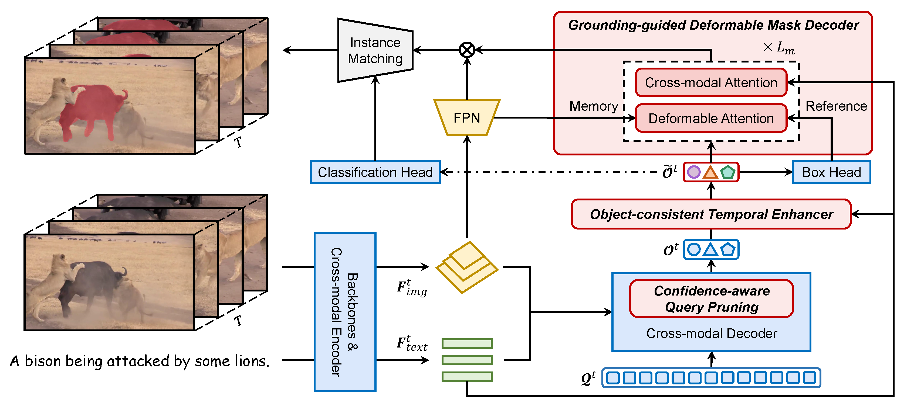

<div align="center">

<h2>ReferDINO: Referring Video Object Segmentation with Visual Grounding Foundations</h2>

[Tianming Liang](https://tmliang.github.io/)¹  &emsp;
[Kun-Yu Lin](https://kunyulin.github.io/)¹  &emsp;
[Chaolei Tan](https://chaoleitan.github.io/)¹  &emsp;
[Jianguo Zhang](https://faculty.sustech.edu.cn/zhangjg/en/)² &emsp;
[Wei-Shi Zheng](https://www.isee-ai.cn/~zhwshi/)¹  &emsp;
[Jian-Fang Hu](https://isee-ai.cn/~hujianfang/)¹*

¹Sun Yat-sen University &emsp;
²Southern University of Science and Technology

**ICCV 2025**

<h3 align="center">
  <a href="https://isee-laboratory.github.io/ReferDINO/" target='_blank'>Project Page</a> |
  <a href="https://arxiv.org/abs/2501.14607" target='_blank'>Paper</a>
  <a href="https://huggingface.co/spaces/liangtm/referdino" target='_blank'>Demo</a>
</h3>

</div>



## 📢 News
* `2025.8.09` Our demo is available on HuggingFace Space! Try [here](https://huggingface.co/spaces/liangtm/referdino)! 
* `2025.8.09` Demo script is available.
* `2025.6.28` Swin-B checkpoints are released.
* `2025.6.27` All training and inference code for ReferDINO is released.
* `2025.6.25` ReferDINO is accepted to ICCV 2025 ! 🎉 
* `2025.3.28` Our [ReferDINO-Plus](https://github.com/iSEE-Laboratory/ReferDINO-Plus), an ensemble approach of ReferDINO and SAM2, 
achieved the 2nd place in [PVUW](https://pvuw.github.io/) challenge RVOS Track at CVPR 2025! 🎉 See our [report](https://arxiv.org/pdf/2503.23509) for details!

## 👨‍💻 TODO
- [X] Release demo code and online demo.
- [X] Release model weights.
- [X] Release training and inference code.

## 🔎 Framework


## Environment Setup
We have tested our code in PyTorch 1.11 and 2.5.1, so either version should be compatible.

```
# Clone the repo
git clone https://github.com/iSEE-Laboratory/ReferDINO.git
cd ReferDINO

# [Optional] Create a clean Conda environment
conda create -n referdino python=3.10 -y
conda activate referdino

# Pytorch
conda install pytorch==2.5.1 torchvision==0.20.1 torchaudio==2.5.1  pytorch-cuda=11.8 -c pytorch -c nvidia

# MultiScaleDeformableAttention
cd models/GroundingDINO/ops
python setup.py build install
python test.py
cd ../../..

# Other dependencies
pip install -r requirements.txt 
```

Download pretrained GroundingDino as follows and put them in the diretory `pretrained`.
```
wget https://github.com/IDEA-Research/GroundingDINO/releases/download/v0.1.0-alpha/groundingdino_swint_ogc.pth
wget https://github.com/IDEA-Research/GroundingDINO/releases/download/v0.1.0-alpha2/groundingdino_swinb_cogcoor.pth
```

## Try ReferDINO on your video
We provide a script for fast applying ReferDINO with given video and text.

```
python demo_video.py <video_path> --text "a description for the target" -ckpt ckpt/ryb_mevis_swinb.pth
```

## Data Preparation
Please refer to [DATA.md](assets/DATA.md) for data preparation.

The directory struture is organized as follows.

```
ReferDINO/
├── configs
├── data
│   ├── coco
│   ├── a2d_sentences
│   ├── jhmdb_sentences
│   ├── mevis
│   ├── ref_davis
│   └── ref_youtube_vos
├── datasets
├── models
├── eval
├── tools
├── util
├── pretrained
├── ckpt
├── misc.py
├── pretrainer.py
├── trainer.py
└── main.py
```

## Get Started
The results will be saved in `output/{dataset}/{version}/`. If you encounter OOM errors, please reduce the batch_size or the `num_frames` in config file.

* Pretrain `Swin-B` on `coco` datasets with 8 GPUs. You can either specify the gpu indices with `--gids 0 1 2 3`. 

```
python main.py -c configs/coco_swinb.yaml -rm pretrain -bs 12 -ng 6 --epochs 20 --version swint --eval_off
```

* Finetuning on Refer-YouTube-VOS with the pretrained checkpoints.
```
python main.py -c configs/ytvos_swinb.yaml -rm train -bs 2 -ng 8 --version swinb -pw ckpt/coco_swinb.pth --eval_off
```

* Inference on Refer-YouTube-VOS.
```
PYTHONPATH=. python eval/inference_ytvos.py -c configs/ytvos_swinb.yaml -ng 8 -ckpt ckpt/ryt_swinb.pth --version swinb
```

* Inference on MeViS Valid Set.
```
PYTHONPATH=. python eval/inference_mevis.py --split valid -c configs/mevis_swinb.yaml -ng 8 ckpt/mevis_swinb.pth --version swinb
```

* Inference on A2D-Sentences (or JHMDB-Sentences).
```
PYTHONPATH=. python main.py -c configs/a2d_swinb.yaml -rm train -ng 8 --version swinb -ckpt ckpt/a2d_swinb.pth --eval
```

## Model Zoo
We have released the following model weights on [HuggingFace](https://huggingface.co/liangtm/referdino/tree/main). Please download and put them in the diretory `ckpt`.

| Train Set             |   Backbone    | Checkpoint                                                                          |
|-----------------------|:-------------:|-------------------------------------------------------------------------------------|
| coco                  |    Swin-B     | [coco_swinb.pth](https://huggingface.co/liangtm/referdino/blob/main/coco_swinb.pth) |
| coco, ref-youtube-vos |    Swin-B     | [ryt_swinb.pth](https://huggingface.co/liangtm/referdino/blob/main/ryt_swinb.pth)   |
| coco, a2d-sentences   |    Swin-B     | [a2d_swinb.pth](https://huggingface.co/liangtm/referdino/blob/main/a2d_swinb.pth)   |
| mevis                 |    Swin-B     | [mevis_swinb.pth](https://huggingface.co/liangtm/referdino/blob/main/mevis_swinb.pth) |
| coco, ref-youtube-vos, mevis |    Swin-B     | [ryb_mevis_swinb.pth](https://huggingface.co/liangtm/referdino/blob/main/ryb_mevis_swinb.pth) |

## Acknowledgements
Our code is built upon [ReferFormer](https://github.com/wjn922/ReferFormer), [SOC](https://github.com/RobertLuo1/NeurIPS2023_SOC) and [GroundingDINO](https://github.com/IDEA-Research/GroundingDINO). We sincerely appreciate these efforts.

## Citation
If you find our work helpful for your research, please consider citing our paper.
```bibtex
@inproceedings{liang2025referdino,
    title={ReferDINO: Referring Video Object Segmentation with Visual Grounding Foundations},
    author={Liang, Tianming and Lin, Kun-Yu and Tan, Chaolei and Zhang, Jianguo and Zheng, Wei-Shi and Hu, Jian-Fang},
    booktitle={Proceedings of the IEEE/CVF International Conference on Computer Vision},
    year={2025}
}
```
